# Universidad Católica del Uruguay

 
## Facultad de Ingeniería y Tecnologías
### Programación II
 
## Demostración: Cliente de Telegram
 
 
### Introducción
Este semestre trabajaremos con ChatBots, por lo cual una de las piedras angulares del proyecto será poder configurar un cliente, el cual nos provea de las funcionalidades básicas de un ChatBot.
Este casó y con tal propósito utilizaremos un cliente para la plataforma [Telegram](https://telegram.org/).
 
 
### Pre-Requisitos
1. Como primer paso debes tener correctamente configurado el ambiente de desarrollo, ver repositorio de [Herramientas](https://github.com/ucudal/PII_Herramientas) del curso.

2. También debes estar registrado en [Telegram](https://telegram.org/), puedes utilizar cualquiera de tus plataforma preferidas ya que tenemos la App disponibles para la gran mayoría de ellas.
 
 
3. Ganas de divertirte 🎉 🎉 
 
 
### Configurar mi Bot
1. Una vez que hayas descargado la App, vamos a buscar un ChatBot 🤖, el cual nos asistirá en la creación de nuestros ChatBots(si un ChatBot que crea ChatBots) 😮. 
Este ChatBot se llama **[BotFather](https://telegram.me/botfather)** y deben buscarlo como **[@botfather](https://telegram.me/botfather)**.

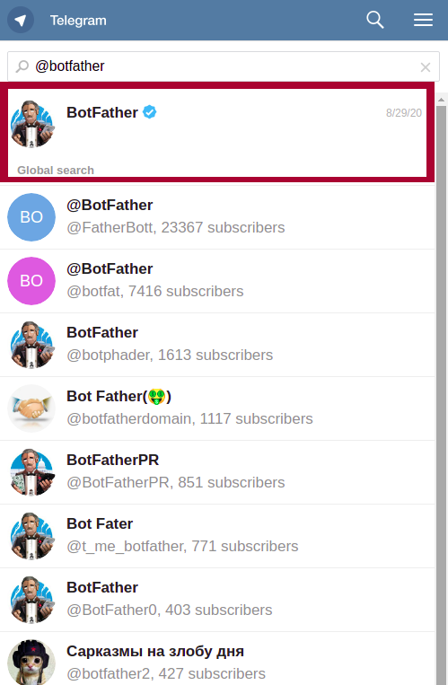
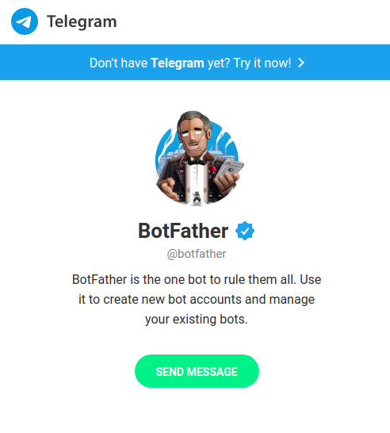
 
2. Hacemos click sobre el Bot para comenzar nuestra "conversación", y a continuación se nos muestra una pantalla de información sobre la documentación de todo lo referente a los [Bots](https://es.wikipedia.org/wiki/Bot_conversacional) y a las [APIs](https://es.wikipedia.org/wiki/Web_API#:~:text=Una%20API%20es%20una%20interfaz,funciones%20de%20un%20determinado%20software.) que telegram nos ofrece.
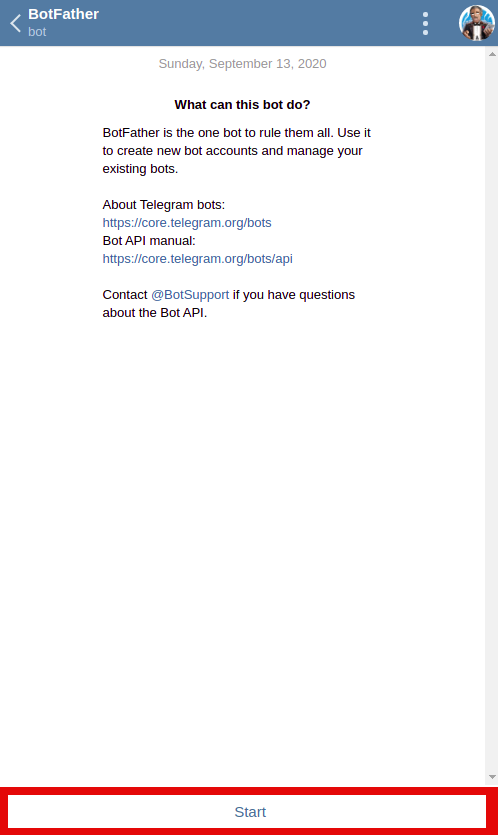
 
3. En la parte inferior podemos ver un link con la palabra **Start**, hacemos click,
de esta manera comenzamos la "conversación" con el bot y él mismo nos desplegará la lista de comandos que reconoce.
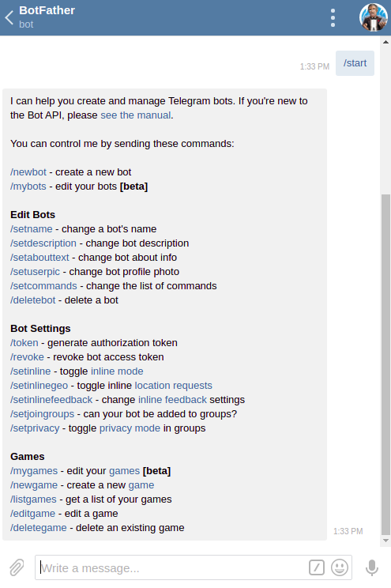
 
4. En nuestro caso vamos a crear un nuevo Bot por lo que si hacemos click sobre el enlace **/newbot** o escribimos el comando **"/newbot"** comenzaremos con el flujo de creación del bot.
  
   1. Como primer paso se nos pide un nombre para el bot en mi caso lo llamare **MiPrimerBot**
  
   2. Debemos ponerle un nombre de usuario al bot, es importante el que mismo termine con la palabra "bot" por ejemplo **pii_mi_primer_bot**
  
   3. Una vez finalizado el paso anterior BotFather nos proveerá un token el cual utilizaremos en nuestro cliente.
   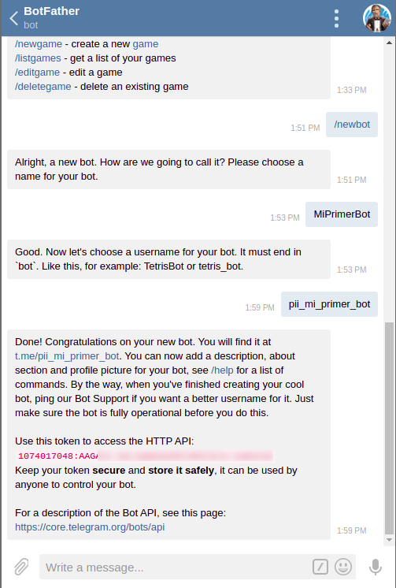

### Estructura del Código
La estructura de nuestro proyecto, es la que utilizamos habitualmente en el curso.

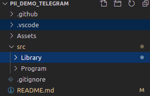

En el proyecto Library, encontraremos la clase TelegramBot, la cual nos proveera de una instancia del cliente para telegram.

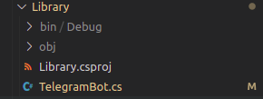

### Interactuando con nuestro Bot
Si examinamos la clase TelegramBot, podemos ver que en la línea 11, tenemos la declaración de la siguiente constante.
 
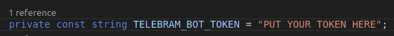

en la cual debemos reemplazar el texto 
**"PUT YOUR TOKEN HERE"** por el token que obtuvimos en el paso anterior.

una ver realizado esto, podemos compilar y correr nuestro proyecto para comenzar a usar nuestro fantastico bot 🎉 🎉 

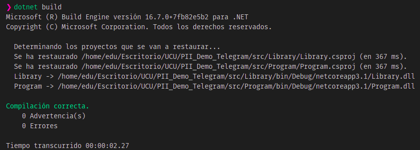

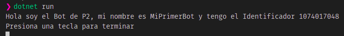

Vamor a nuestra aplicación de Telegram y buscamos 
**pii_mi_primer_bot** y le pedimos que nos de la lista de comandos escribiendo "/comandos".

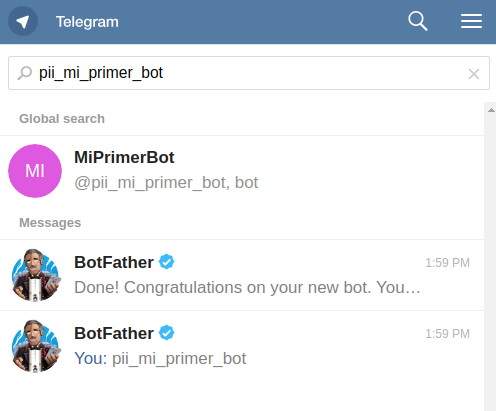

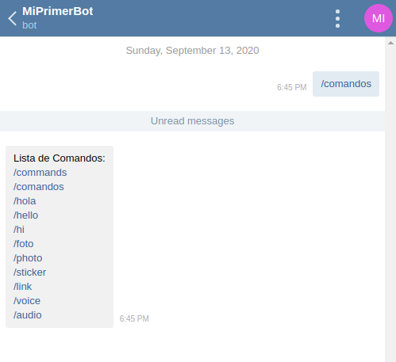

Probemos por ejemplo saludar a nuestro Bot 🖐🤓 **"/hola"**

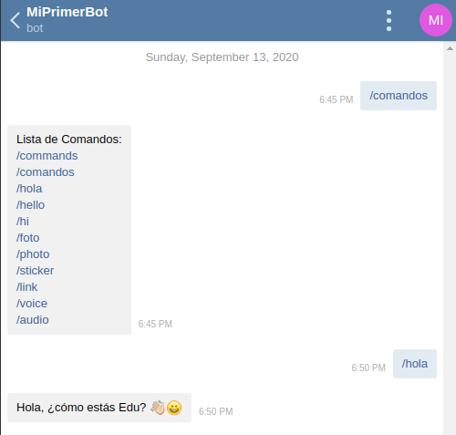

## **Genial 🎉🎉 🤓 🎉🎉 , tengo mi primer Bot funcionando**.

Esto es todo por el momento... ahora es tu turno de crear un fantastico Bot !!!

### Referencias
Para el desarrollo del Bot utilizamos las librerias de [TelegramBots para C#](https://github.com/TelegramBots/Telegram.Bot).

Como también las guías oficiales de [Telegram](https://core.telegram.org/bots) sobre Bots.

